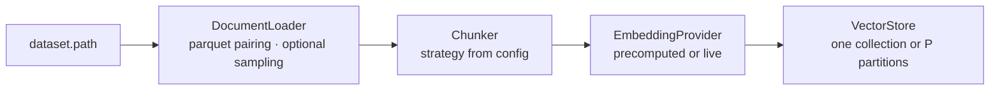
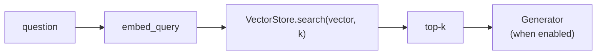
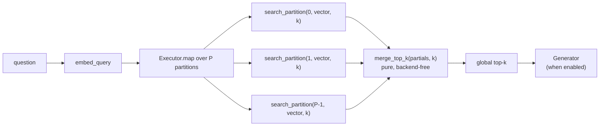

# Architecture

`rag_framework` is a modular retrieval-augmented generation pipeline
over the Open Web Index. Every stage sits behind a small interface
("seam"), backends are selected by configuration, and the application
object — `RAGPipeline` — only wires seams together and times them. The
research question the design serves: *can a local implementation evolve
into a distributed one by replacing components instead of rewriting the
application?* The design answer is that every replacement so far
(official chunks and vectors, an embedding cache, corpus sampling, a
partitioned store, a thread executor) entered as an adapter of an
existing seam, and `RAGPipeline.ingest()` / `query()` did not change.

## 1. Seams

Seven **substitutable seams** carry the data path. Each is a small
interface with at least two implementations. Most are chosen by name in
the configuration; two decorators are reached another way, because they
wrap an implementation rather than replace it: the corpus sampler
switches on when `dataset.sample_percent` is below 100, and the
embedding cache has no configuration name at all and is applied from
Python.

| seam | package | interface | implementations | typed failure |
|---|---|---|---|---|
| document loading | `loaders/` | `DocumentLoader.load(source) -> Iterator[Document]` | `OwiLoader`, `SampledLoader` (decorator) | `LoaderError` |
| chunking | `chunking/` | `Chunker.split(documents) -> Iterator[Chunk]` | `PublisherOffsetsChunker`, `RecursiveChunker` | rejections (per document) |
| embeddings | `embeddings/` | `EmbeddingProvider.embed_documents(chunks)`, `embed_query(text)` | `PrecomputedEmbeddingProvider`, `LocalEmbeddingProvider`, `CachedEmbeddingProvider` (decorator) | `EmbeddingError` |
| vector store | `vectorstores/` | `VectorStore.create_or_open / add / search / count / reset / iter_vectors` | `ChromaVectorStore`, `PartitionedVectorStore` (composite) | `VectorStoreError` |
| retrieval | `retrieval/` | `Retriever.retrieve(query, k) -> list[SearchResult]` + `timings` | `SequentialRetriever`, `CollectiveRetriever`; pure helpers `partition_for`, `merge_top_k` | `RetrievalError` |
| execution | `executors/` | `Executor.map(fn, items) -> list[TaskOutcome]` | `SerialExecutor`, `ThreadExecutor` | failures captured per task |
| generation | `generation/` | `Generator.generate(query, context) -> str` | `MockGenerator` (deterministic, extractive), `OllamaGenerator` (local HTTP endpoint, greedy decoding, grounded-refusal contract) | `GenerationError` |

Two **cross-cutting layers** touch every run without sitting on the data
path — nothing flows *through* them, so they have no alternative
implementations to select:

| layer | package | responsibility | typed failure |
|---|---|---|---|
| configuration | `config.py` | validates the whole run description before any work starts | `ConfigError` |
| metrics | `metrics/` | `run_manifest`, `write_report`, pure quality/comparison functions, `exact_top_k`; the only writer of result files | — |

Joining them is the orchestrator, `orchestration/pipeline.py`: name
resolving factories plus `RAGPipeline`, which connects each seam's output
to the next one's input and times every stage. It holds no logic of its
own, which is why swapping an implementation never modifies it.

The canonical data model lives in `models.py`: `Document`, `Chunk`,
`SearchResult` (score is a similarity, higher is better, with
`partition_id` / `worker_id` provenance), `RAGResult`,
`IngestionReport`, `Rejection`, and the deterministic identifier
functions (`make_document_id`, `make_chunk_id`, `stable_bucket`).

## 2. Boundaries that are never crossed

- **OWI parsing happens only in `loaders/owi.py`.** Parquet pairing,
  schema quirks, offsets and official vectors are read there and
  nowhere else; the rest of the system sees `Document` objects with
  metadata.
- **ChromaDB is imported only in `vectorstores/chroma.py`.** Distance to
  similarity conversion, batch limits, collection metadata and filter
  syntax are translated at that boundary. `PartitionedVectorStore`
  composes stores through the interface and never touches the backend.
- **Concurrency lives only in `executors/`.** Retrievers decide *what*
  to run and what a failure means; executors decide *how* it runs. A
  remote executor must satisfy the same `map` contract, which is the
  concrete form of the research question.
- **Result files are written only by `metrics/manifest.py`.**
  Benchmarks compute, the metrics layer records; every report carries
  the effective configuration, dataset version, git commit (with a
  `-dirty` flag when the tree had local changes), machine, dependency
  versions and timestamp.

## 3. Data flow

### Ingestion

`RAGPipeline.ingest()` streams documents, batches chunks (512 per
embed/store round trip), times embedding and indexing separately, and
returns an `IngestionReport` with every counter the report needs.
Re-ingesting unchanged input is idempotent: chunk ids are deterministic
and the store upserts.

### Sequential query

### Collective query

Each partial list carries its `partition_id`, and the retriever stamps
the `worker_id` that produced it, so every hit in the merged result can
be traced back to where it was found.

Both modes are selected by `retrieval.mode`; `RAGPipeline.query()` is
the same code for both and reports the same metric keys (collective-only
stages are `null` in sequential mode).

## 4. Determinism

- `document_id` is the publisher's stable record id; `chunk_id` is a
  SHA-256 over a length-prefixed `(document_id, position, normalized
  text)` payload. Re-ingestion produces the same ids.
- Partition assignment is `stable_bucket(document_id, P)` — SHA-256
  based, never Python's salted `hash()` — so all chunks of a document
  share a partition and a rebuild reproduces the layout on any machine.
  Corpus sampling (`dataset.sample_percent`) uses the same function, so
  subsets are nested (10 % ⊂ 25 % ⊂ 50 %).
- `merge_top_k` orders by `(score descending, chunk_id ascending)`: a
  total order, so equal scores never depend on which worker answered
  first. Duplicate chunk ids keep the best candidate and are logged;
  non-finite scores raise.
- Partition layout is part of an index's identity: partition `i` of
  `P` lives in collection `<name>-p{i:02d}of{P:02d}` and is stamped with
  the layout; a collection can never be opened under another layout.

## 5. Validation and failure handling

Three layers, each failing before any work runs:

1. **Configuration** (`config.py`): structure and topology — every key
   with the right type, unknown and duplicate keys rejected, no
   coercion, value-dependent shapes (`publisher_offsets` admits no token
   sizes; `sequential` admits one partition and one worker; a serial
   executor admits one worker).
2. **Factories** (`orchestration/pipeline.py`): whether a component
   name is registered, and cross-seam coherence (`recursive` chunking
   cannot use `precomputed` vectors; `collective` requires the
   partitioned store).
3. **Components at run time**: filesystem facts, backend state
   (an existing collection with a different embedding identity is
   refused; querying an empty collection is refused).

Per-record problems are *rejections* — logged, counted, sampled into
reports — never silent drops. Conditions that invalidate the run are
typed errors (`LoaderError`, `EmbeddingError`, `VectorStoreError`,
`RetrievalError`, `GenerationError`, `ConfigError`); backend exceptions
never escape raw; the CLI turns them into a message and a non-zero exit
code. A failed partition search fails the whole collective query naming
the partition and worker; there are no silent partial results.

## 6. What is, and is not, claimed

The collective mode is a **local simulation of collective retrieval**:
P Chroma collections on one machine searched by threads. It
demonstrates the seams — partitioning, executor, merge, provenance —
and measures their cost; it does not demonstrate distribution. On the
evaluation corpus (6,240 vectors) it is slower than the single
collection at every partition count and exactly as correct as a
brute-force reference (the single collection's approximate index is
the one that misses). See `docs/limitations.md`.

What a distributed deployment would replace: the `Executor` (a
function-as-a-service or rack executor satisfying `map`) and the inner
`VectorStore` of each partition (a remote or specialised backend — see
`docs/adding-a-vector-store.md`). `RAGPipeline`, the retrievers, the
merge and the metrics layer would not change.

## 7. Public entry points

- `RAGPipeline.from_config(path)`, `.ingest() -> IngestionReport`,
  `.query(question, k=None, *, retrieval_only=False) -> RAGResult`.
- CLI: `python -m rag_framework ingest --config …` and
  `python -m rag_framework query --config … --question … [--k N]
  [--retrieval-only]`; both write a report under `metrics.output`.
- Benchmarks under `benchmarks/` (see `docs/experiment-guide.md`).
